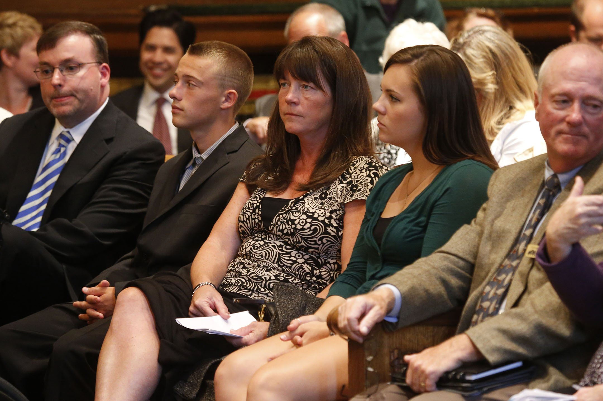

In 2007, a group of families, schools districts, teachers unions and a host of others sued the state of Washington over school funding. The case, which you may be familiar with, is known as McCleary vs. State of Washington, named after the lead plaintiffs, parent Stephanie McCleary, her husband and children, who live in the Chimacum School District near Port Townsend. 

<aside class="nonbreak caption sidebar">
  Plaintiff Stephanie McCleary, center, and her son Carter McCleary, 15, left, and Kelsey McCleary, 20, right, attend the show-cause hearing on Sept. 3, 2014, where the Washington Supreme Court heard arguments over whether it should sanction state lawmakers for failing to make enough progress toward adequately funding public education. (Erika Schultz / The Seattle Times)
</aside>

<aside class="break caption sidebar">
  Plaintiff Stephanie McCleary, center, and her son Carter McCleary, 15, left, and Kelsey McCleary, 20, right, attend the show-cause hearing on Sept. 3, 2014, where the Washington Supreme Court heard arguments over whether it should sanction state lawmakers for failing to make enough progress toward adequately funding public education. (Erika Schultz / The Seattle Times)
</aside>

The McCleary plaintiffs <a href="http://waschoolexcellence.org/cms/wp-content/uploads/NEWS-lawsuit-2007.pdf">argued that the state wasn’t giving schools enough money,</a> which forced local school districts to raise the rest through local property-tax levies. (We’ll come back to levies in just a bit.)

They also argued that the needs of schools and students had changed over time but state funding hadn’t kept up. For example, the state, until recently, wasn’t paying for six periods of high school, even though that’s what most students need to get into college these days.

The McCleary plaintiffs took their arguments all the way to the state Supreme Court. And in 2012, the majority of justices ruled in their favor.  

<a href="#top"><i class="fa fa-caret-up"></i> Back to top</a>
