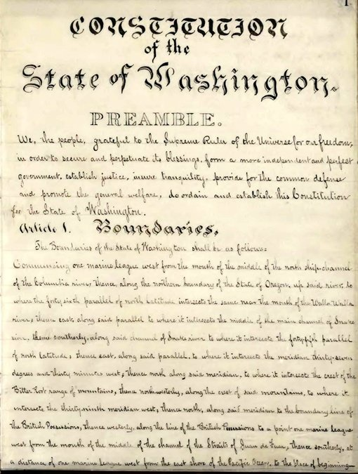

<aside class="sidebar">
  Here's the court's decision that you can <a href="http://www.courts.wa.gov/opinions/pdf/843627.opn.pdf">read</a>
</aside>

<aside class="sidebar">
  Read Washington's full constitution or the full section on education <a href="http://leg.wa.gov/LawsAndAgencyRules/Pages/constitution.aspx">here</a>
</aside>

In its ruling, the state Supreme Court pointed to one sentence in the state constitution: 

“It is the paramount duty of the state to make ample provision for the education of all children residing within its borders, without distinction or preference on account of race, color, caste, or sex.”

That makes it very clear: The state &mdash; not local school districts, not the federal government &mdash; needs to cover the costs of a basic education for Washington’s schoolchildren. In fact, Washington has one of the strongest obligations to fund public education in the nation. 

The state Supreme Court’s role is to enforce the constitution. And after weeks of testimony about what the state’s on the hook to cover, the justices agreed with the plaintiffs:  The state was falling short, forcing local districts to pick up the tab. 

The state, the justices wrote, had failed to meet its constitutional duty by “consistently providing school districts with a level of resources that falls short of the actual costs of the basic education program.”

But what the constitution doesn’t define, and what the justices don’t have control over, is how the state defines what’s included in a basic education. That’s the job of lawmakers.

That’s one reason there’s been so much debate about the McCleary ruling. The Legislature can’t come to a consensus on what a basic education includes.  

And this isn’t the first time this debate has happened.

The McCleary case is the latest chapter in a long-running argument over how much the state should provide public schools. In the 1970s, a similar group of school districts, parents and teachers filed a similar suit and won by making the same argument: Lawmakers were not upholding the state constitution, and therefore were failing their paramount duty.  

So why are we having a similar battle over education funding today? Part of the answer lies in levies.

Back to top
